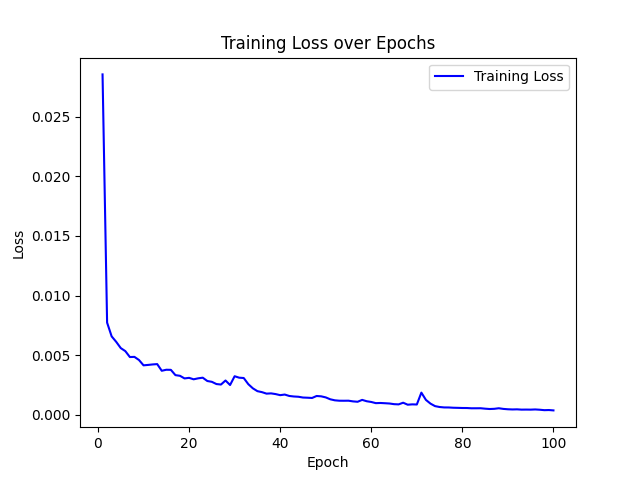
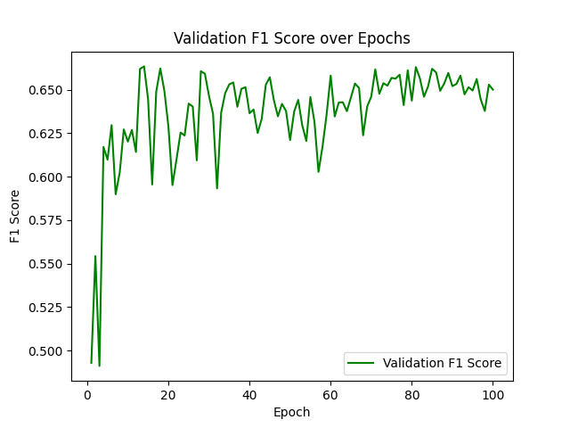
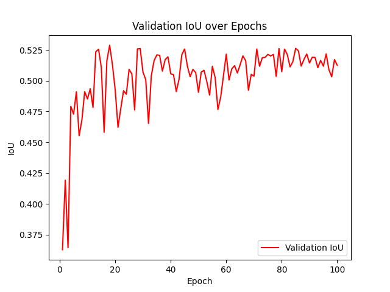

# UCF -  infrared weak target segmentation

This algorithm solves the problem of loss of target details caused by downsampling in traditional models during feature extraction, and improves the model's ability to express small-sized targets.
Secondly, to address the challenge of noise interference in target recognition in complex backgrounds, the feature attention ability of each layer is enhanced, effectively suppressing the influence of irrelevant regions and improving segmentation accuracy. 
Thirdly, the model significantly improves the performance of MDvsFA test set by optimizing feature extraction and robustness, and increases F1 score to 0.67. 
Overall, this code provides a more efficient solution for infrared weak target segmentation by enhancing feature expression, reducing background interference, and improving generalization ability. It is suitable for scenarios such as infrared image processing and medical image analysis.

## Precondition
- Python >= 3.10 
- PyTorch
- The complete dependency list can be found at`requirements.txt`

## Installation
1. Clone repository:
2. Install requirements:
   ```bash
    pip install -r requirements.txt
## Data set
- Put the dataset into the data/folder with the following structure:
  ```bash
    data/
    ├── train/
    │   ├── image/
    │   └── mask/
    └── test/
        └── MDvsFA/
            ├── image/
            └── mask/
## File description
- dataloader.py： Dataset and data loader settings.
- model.py： Model architecture based on U-Net, CBAM, and FPN.
- train.py： Training logic.
- eval.py： Evaluation and drawing functions.
- test.py： Test the best model.
- main.py： Integrate the main script of all modules.
## Run the project
- Ensure that the 'data' folder contains training and testing data (images and masks).
- Run the following command on the terminal to start training and testing:
- Train the model for 100 epochs.
- Save the best model to export_images/best_madel.pth.
- Generate charts of loss, F1 score, and IoU in output images/.
- Use the best model to evaluate on the test set.
- After training is completed, the terminal will output the F1 score and IoU of the best model, and the performance chart (loss, F1 score, IoU) will be saved in the export_images/folder.
  ```bash
    python main.py
## Final result
- The loss function graph obtained from training
- 
- F1score function graph obtained during the training process
- 
- IOU function graph obtained during the training process
- 
- Best F1 Score: 0.6734, Corresponding IoU: 0.5316
